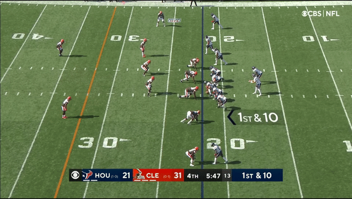

```{r setup, include=FALSE}
knitr::opts_chunk$set(echo = FALSE)
library(tidyverse)
library(knitr)
library(kableExtra)
```

# Introduction

Offensive linemen provide key value in a football game, which often goes unnoticed on box scores and game logs. While there are plenty of metrics and statistics for ball-handlers and defenders, there are not many commonly used statistics to evaluate offensive linemen.

We create a novel scoring system for offensive linemen based on the type of rush they encounter. We note the need for different models for different rush types, as they significantly affect the evaluation of the offensive lineman on that play.

We identify two common rushing techniques employed by defensive ends: bull/power rush (hereby referred to as power rush) and speed rush. A speed rush, as identified in Figure 1 below, is a rush in which the defender attempts to speed around the lineman and reach the quarterback before the lineman for a sack.



A power rush, demonstrated in Figure 2 below, occurs when the defender attempts to overpower the lineman by pushing them back, eventually reaching and sacking the quarterback.


The figures above make it clear that offensive linemen must be assessed differently for speed and power rushes. For blocking against speed rushing, the key for a lineman is to have a quick "get-off time", or time to move back from their initial position on the line of scrimmage. The first couple moments of the play are crucial when the edge rusher is speed rushing, as the offensive lineman must move back far enough and quick enough to block a defender attempting to get around the lineman. For power rushing, the key for the lineman is to not allow the defender to overpower them, or not give up any distance to the quarterback. Against power rushing, a lineman is successful if they do not allow the rusher to push them back towards the quarterback. This will be more formally defined in the following section.

# Methods

We seek to model the performance of offensive tackles by first modeling the defender's rush type (speed or power), then modeling individual tackle performance, holding all other important factors constant. We chose to focus only on offensive tackles and not evaluate other positions because their blocking can often be more isolated from the center and guards, and double teams and stunts are less common for tackles. At a high level, our project methods can be viewed in three phases: data cleaning, speed vs. power modeling, and individual offensive tackle modeling.

## Data Cleaning

Using the expansive, eight-week NFL player tracking data, we first cleaned and filtered the data. We removed the following events from the data for our analysis:

  - Chip blocks
  - QB scrambles
  - Non-standard QB dropbacks
  - All positions other than QBs, tackles, and edge rusher
  - Edge rushers who were also in coverage
  - Edge rushers who disengaged with the tackle (stunt block or other)

Note that a chip block occurs when the running back or tight end "chips" the defender, aiding the lineman, before running their route, thereby aiding them in blocking the defender. Each of these events change the interaction between the lineman and the defender, and would skew our model if left in. We also flipped the position of the right tackles and left ends around the ball so all the tackle-end interactions are on a similar path and direction for modeling. 

## Speed vs. Power Rush Modeling

### Variables

Once the data was prepared, we turned to creating a model to determine whether a specific rush was a speed or power rush. Because there was no label in the data for rush type, this would require an unsupervised model. As a means of evaluating performance of the model, we randomly selected 10 plays, watched the game film, and labeled the rush type for each edge rusher (20 rushers) to create test data. We created four variables for each rush for our models to use in determining rush type:

  1. Mean_tackle_end_dist: Average distance between the tackle and edge rusher on the play
  2. Mean_tackle_end_facing: Average difference between the angle of tackle and rusher (0 indicates facing each other, 180 is facing in opposite directions)
  3. End_dist_travel: Total distance traveled by the edge rusher
  4. Mean_end_speed: Average speed of the edge rusher during the play

### K-Means Clustering and Gaussian Mixture Model

Using these four variables, we created both a K-Means Clustering Model and a Gaussian Mixture Model with two clusters to model rush type. They both correctly predicted 15 of the 20 test plays for an approximate 75% test accuracy. While this accuracy seems low on its face, the five plays it inaccurately classified were difficult to determine in the film and were likely more representative of outliers in the data.

We selected the Gaussian Mixture Model (GMM) to classify power and speed plays because GMMs provide a probability of each observation belonging to each class. This allowed us to filter out rushes that the model was uncertain about (classified as between 50 and 55% probability). The table below shows the centers of the variables for power and speed rushes, which have notably different Mean_tackle_end_facing and End_dist_travel centers.


```{r}
table <- data.frame(Rush_Type=c("Power", "Speed"),
                    Mean_tackle_end_dist=c(1.16615885, 1.15544887),
                    Mean_tackle_end_facing=c(26.1976727, 61.32940427),
                    End_dist_travel = c(7.27401843, 9.67472515),
                    Mean_end_speed = c(2.78494659, 2.98266389))

kable(table, caption="Figure 3: Centers of each variable for power and speed rush types from the Gaussian Mixture Model")%>% kable_styling(bootstrap_options = c("striped", "hover"))%>%row_spec(1:2,bold=T,hline_after = T)
```


To demonstrate an instance of the model in action, we will examine a play from our test set, in the third quarter of the October 10, 2021 Cardinals vs. 49ers game. We removed all players except the quarterback, tackles, and edge rushers for the animation below. 

```{r, message=F, warning=F, fig.cap="Figure 4: Animated play with just tackles, quarterback, and edge rushers demonstrating speed and power rush"}
library(tidyverse)
library(gganimate)
library(ggplot2)
library(cowplot)
library(repr)
library(gridExtra)

#loading command to make NFL field in ggplot (credit to Marschall Furman)
source("https://raw.githubusercontent.com/mlfurman3/gg_field/main/gg_field.R")


plays <- read.csv("https://media.githubusercontent.com/media/cnickol26/BigDataBowl2023/main/nfl-big-data-bowl-2023/plays.csv")
plays$uniqueplayId <- as.numeric(paste(as.character(plays$gameId), 
                                       as.character(plays$playId), sep=""))

# select all the players besides dbs and wrs
players <- read.csv("https://media.githubusercontent.com/media/cnickol26/BigDataBowl2023/main/nfl-big-data-bowl-2023/players.csv")

positions <- c('DE', 'OLB','DT', 'ILB', 'NT', 'MLB', 'LB', 'RB', 'T', 'TE','G','QB','C','FB')

positions_df <- players[players$officialPosition %in% positions,]
players_list <- positions_df$nflId


subset <-read.csv("https://github.com/cnickol26/BigDataBowl2023/blob/main/data_not_flipped.csv?raw=true")


animate_play_subset <- function(play_id){
  df_examplePlay <- plays %>%
    select(uniqueplayId, playDescription) %>%
    filter(uniqueplayId==play_id)
  
  #merging tracking data to play
  df_examplePlayTracking <- inner_join(df_examplePlay,
                                       subset,
                                       by = "uniqueplayId") %>%
    #Standardizing tracking data so its always in direction of offensive team.
    mutate(x = ifelse(playDirection == "left", 120-x, x),
           y = ifelse(playDirection == "left", 160/3 - y, y))
  
  
  ball_location <- which(sort(unique(df_examplePlayTracking$team))=="football")
  
  cols_fill <- c(1, 2, 3)
  cols_fill[ball_location] <- "#663300"
  cols_fill[as.numeric(cols_fill[1:3!=ball_location])] <- c("#013369", "#d50a0a")
    
  cols_col <- c("#000000", "#000000", "#000000")
  cols_col[ball_location] <- "#663300"
      
  size_vals <- c(8, 8, 8)
  size_vals[ball_location] <- 5
    
  shape_vals <- c(21, 21, 21)
  shape_vals[ball_location] <- 16
    
  plot_title <- df_examplePlay$playDescription
  nFrames <- max(df_examplePlayTracking$frameId)
  
  
  
  field_min <- floor(min(df_examplePlayTracking$x))-5
  field_max <- floor(max(df_examplePlayTracking$x))+5
  
  #plotting
  anim <- ggplot() +
    
    
    #creating field underlay
    gg_field(yardmin = field_min, yardmax = field_max) +
    
    #filling forest green for behind back of endzone
    theme(panel.background = element_rect(fill = "forestgreen",
                                          color = "forestgreen"),
          panel.grid = element_blank()) +
    
    
    #setting size and color parameters
    scale_size_manual(values = size_vals, guide = "none") + 
    scale_shape_manual(values = shape_vals, guide = "none") +
    scale_fill_manual(values = cols_fill, guide = "none", na.value=NA) + 
    scale_colour_manual(values = cols_col, guide = "none") +
    
    
    #adding players
    geom_point(data = df_examplePlayTracking, aes(x = x,
                                                  y = y, 
                                                  shape = team,
                                                  fill = team,
                                                  group = nflId,
                                                  size = team,
                                                  colour = team), alpha=0.7) +  
    
    #adding jersey numbers
    geom_text(data = df_examplePlayTracking,
              aes(x = x, y = y, label = jerseyNumber),
              colour = "white", 
              vjust = 0.36, size = 3.5) + 
    
    
    #titling plot with play description
    labs(title = plot_title) +
    
    #setting animation parameters
    transition_time(frameId)  +
    ease_aes("linear")
  
  
  animate(anim, width = 720, height = 440,fps = 10, nframes = nFrames)
  
}

animate_play_subset(20211010112817)
```

The model correctly classifies the left edge rusher (jersey number 98) as a speed rush with 69% probability and the right edge rusher (jersey number 56) as a power rush with 92% probability. The model was successful in predicting rush type, and we will use its classifications in our Bayesian Hierarchical Model to model power and speed rushes seperately.

## Bayesian Hierarchical Model


# Results

# Discussion

Our analysis could certainly be extended to centers and guards, but some important changes would be required. Could compare our analysis with salary data, though we are not analzying overall performance.


